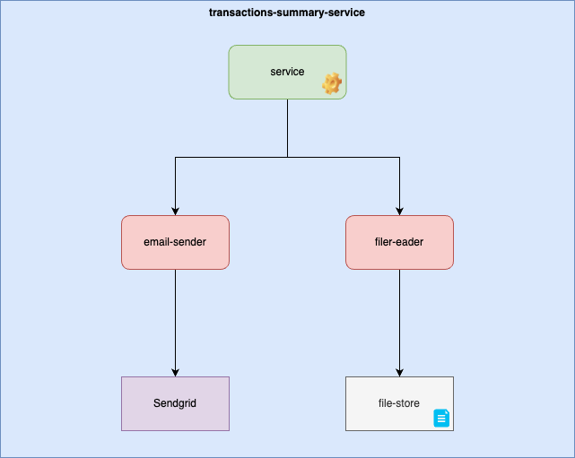
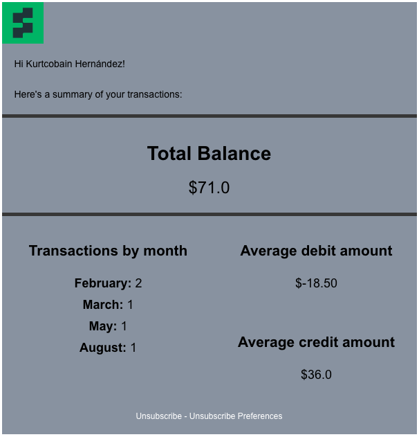

# transactions-summary-service

Simple service that reads a transactions file in a csv format, processes it and logs the output. It can also send a report email with that data.

Data:
- Total balance
- Number of transactions by month
- Average credit amount
- Average debit amount

## Service project structure


## How to run the code

The current csv file to be read is located in `txns/migrmrz/txns.csv` which, on build, will be copied over to a mount directory inside the docker container. The new location inside the container should be `/mnt/transactions/<usr-folder>/txns.csv` and that needs to be set inside the configuration file located in `internal/config/transactions-summary.yaml` with `transactions-file`.

Configuration file also has information on end user's email and name, as well as a key to turn on/off sending the email so this can be switched back and forth depending on what the user wants to happen. Also, an API key is needed.
```yaml
send-email: false
to-user-name: Some Name 
to-email: somename@example.com 
```

### Docker

#### Build (located inside the `transactions-summary-service` project folder)
```
docker build -t transactions-summary-service .
```

#### Run (first time. once the image has been successfully created)

```
docker run --name transactions-summary-service transactions-summary-service
```

#### Start
```
docker start -a transactions-summary-service
```

#### Outputs
##### Build
```
[+] Building 6.3s (17/17) FINISHED                                                                     docker:desktop-linux
 => [internal] load build definition from Dockerfile                                                                   0.0s
 => => transferring dockerfile: 559B                                                                                   0.0s
 => [internal] load metadata for docker.io/library/golang:1.20.12-alpine3.19                                           0.8s
 => [internal] load .dockerignore                                                                                      0.0s
 => => transferring context: 2B                                                                                        0.0s
 => [ 1/12] FROM docker.io/library/golang:1.20.12-alpine3.19@sha256:3ae92bcab3301033767e8c13d401394e53ad2732f770c313a  0.0s
 => [internal] load build context                                                                                      0.0s
 => => transferring context: 9.77kB                                                                                    0.0s
 => CACHED [ 2/12] WORKDIR /app/transactions-summary-service                                                           0.0s
 => CACHED [ 3/12] COPY go.mod ./                                                                                      0.0s
 => CACHED [ 4/12] COPY go.sum ./                                                                                      0.0s
 => CACHED [ 5/12] RUN go mod download                                                                                 0.0s
 => CACHED [ 6/12] COPY cmd/ ./cmd                                                                                     0.0s
 => [ 7/12] COPY internal/config/transactions-summary-service.yaml /etc/transactions-summary-service/                  0.0s
 => [ 8/12] COPY txns/ /mnt/transactions/                                                                              0.0s
 => [ 9/12] COPY internal/ ./internal                                                                                  0.0s
 => [10/12] COPY scripts/ ./scripts                                                                                    0.0s
 => [11/12] COPY txns/ ./txns                                                                                          0.0s
 => [12/12] RUN go build -v -o ./build/transactions-summary-service ./cmd/transactions-summary-service/main.go         5.1s
 => exporting to image                                                                                                 0.2s
 => => exporting layers                                                                                                0.2s
 => => writing image sha256:fc98aa8fb319fdd4df37974f141a8047c210f5fbd0853b1f82271e6ab12c1c3b                           0.0s
 => => naming to docker.io/library/transactions-summary-service
```
##### Run (with email flag off)
```
2024/02/12 23:03:37 transactions-summary-service has started...
2024/02/12 23:03:37 reading transactions file and getting data...
2024/02/12 23:03:37 raw data from file: [{1 2/25 +60.5} {2 2/28 -1.8} {3 3/02 +23} {4 5/17 -35.2} {5 8/14 +24.5}]
2024/02/12 23:03:37 averages... debit: -18.50, credit: 36.0
2024/02/12 23:03:37 total balance: 71.0
2024/02/12 23:03:37 transaction count by month: {"August":1,"February":2,"March":1,"May":1}
2024/02/12 23:03:37 something happened while trying to send email: email will not be sent. If this was intended otherwise, check configuration file
2024/02/12 23:03:37 finished...
```

##### Run (with email flag on)
```
2024/02/12 23:13:59 transactions-summary-service has started...
2024/02/12 23:13:59 reading transactions file and getting data...
2024/02/12 23:13:59 raw data from file: [{1 2/25 +60.5} {2 2/28 -1.8} {3 3/02 +23} {4 5/17 -35.2} {5 8/14 +24.5}]
2024/02/12 23:13:59 averages... debit: -18.50, credit: 36.0
2024/02/12 23:13:59 total balance: 71.0
2024/02/12 23:13:59 transaction count by month: {"August":1,"February":2,"March":1,"May":1}
2024/02/12 23:13:59 sending email...
2024/02/12 23:13:59 done...
2024/02/12 23:13:59 finished...
```

##### Email


## Dependencies

This project has its main dependency on:
* go (`1.20.12`)
