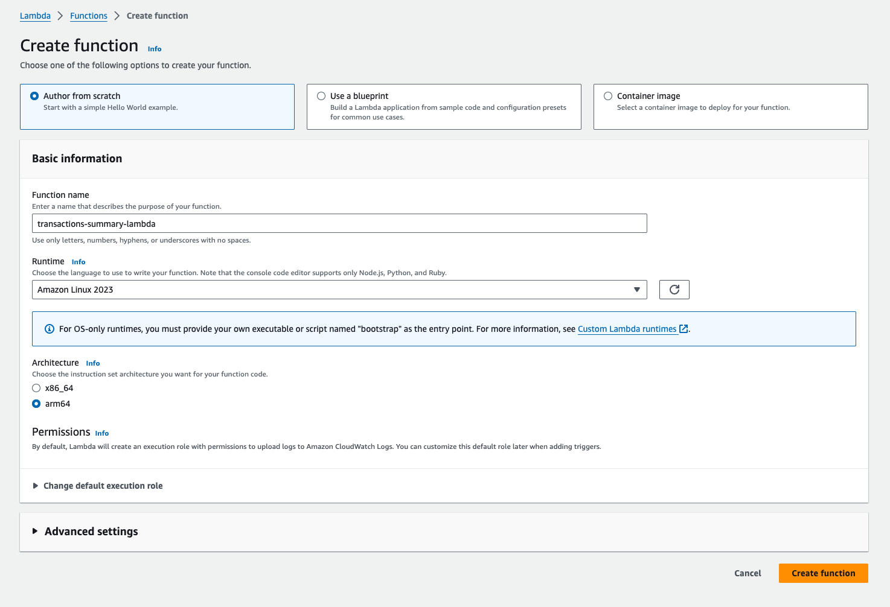

# transactions-summary-service

Simple service that reads a transactions file in a csv format, processes it and sends a report email with the data.
When processing, the following data will be collected to be sent:
- Total balance
- Number of transactions by month
- Average credit amount
- Average debit amount

## How to run the code
1. Build the service
```
GOOS=linux go build -v -o ./build/bootstrap ./cmd/transactions-summary-service/main.go
```

2. Create a zip package (inside the project directory)
```
zip -j transactions-summary-service.zip ./build/bootstrap
```

3. Go to AWS Lambda > Create Function

4. Set function name (e.g. transactions-summary-lambda), Runtime Amazon Linux 2023, architecture arm64


5. Create an Amazon S3 bucket (e.g. transactions-summary-bucket)

6. Make it publicly available for the test (turn off all block to public access)

7. Add the following Bucket Policy
```json
{
    "Version": "2012-10-17",
        "Statement": [
        {
            "Sid": "AllowAllAccessToBucket",
            "Effect": "Allow",
            "Principal": "*",
            "Action": "s3:*",
            "Resource": "arn:aws:s3:::transactions-summary-lambda/*"
        }
        ]
}
```

8. Upload the following files directly into the bucket
    - `internal/config/transactions-summary-service.yaml`
    - `txns/migrmrz/txns.csv`

9. Go back to the AWS Lambda and add a trigger

10. Choose S3 as a source

11. Select the bucket, leave "All object create events" on Event Types and add `.csv` as suffix. Select the acknowledgment and click on Add


12. When an updated version of the `txns.csv` file is uploaded, the AWS Lambda should be triggered to execute and read the file.

### Example Logs
```
INIT_START Runtime Version: provided:al2023.v11	Runtime Version ARN: arn:aws:lambda:us-east-1::runtime:62bd6c5dff0ed427096b4c34978c16e98945c2d64d2f89b8ee3c4fea9e22567a
START RequestId: ae2e9a30-5e8b-4d3a-a617-4facc9c3d035 Version: $LATEST
2024/02/13 07:39:41 transactions-summary-service has started...
2024/02/13 07:39:43 reading transactions file and getting data...
2024/02/13 07:39:43 raw data from file: [{1 2/25 +60.5} {2 2/28 -1.8} {3 3/02 +23} {4 5/17 -35.2} {5 8/14 +24.5} {6 8/18 -20.5}]
2024/02/13 07:39:43 averages... debit: -19.16, credit: 36.0
2024/02/13 07:39:43 total balance: 50.50
2024/02/13 07:39:43 transaction count by month: 
{
    "August": 2,
    "February": 2,
    "March": 1,
    "May": 1
}

2024/02/13 07:39:43 something happened while trying to send email: email will not be sent. If this was intended otherwise, check configuration file
2024/02/13 07:39:43 finished...
END RequestId: ae2e9a30-5e8b-4d3a-a617-4facc9c3d035
REPORT RequestId: ae2e9a30-5e8b-4d3a-a617-4facc9c3d035	Duration: 1363.52 ms	Billed Duration: 1435 ms	Memory Size: 128 MB	Max Memory Used: 30 MB	Init Duration: 70.67 ms
```

## Dependencies

This project has dependencies on:
* go (`1.20.12`)
